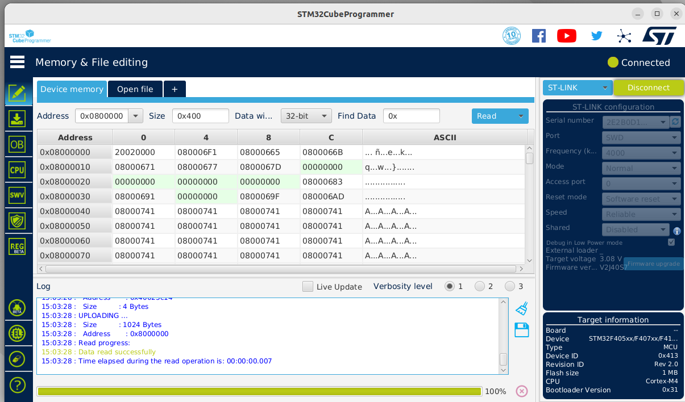
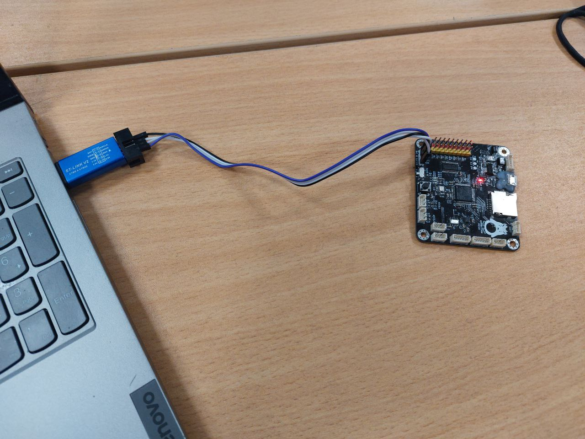

# 23-29 января
## 23.01.2023 четверг
Сегодня начал разбираться с Юриной платой (работаю на Ubuntu)
* установил STM32CubeProgrammer
* Поставил драйверы для ST-LINK V2
* Обновил устаревшую прошивку на st-link v2
* подключил плату к STM32CubeProgrammer

  

* научились заливать программы на плату