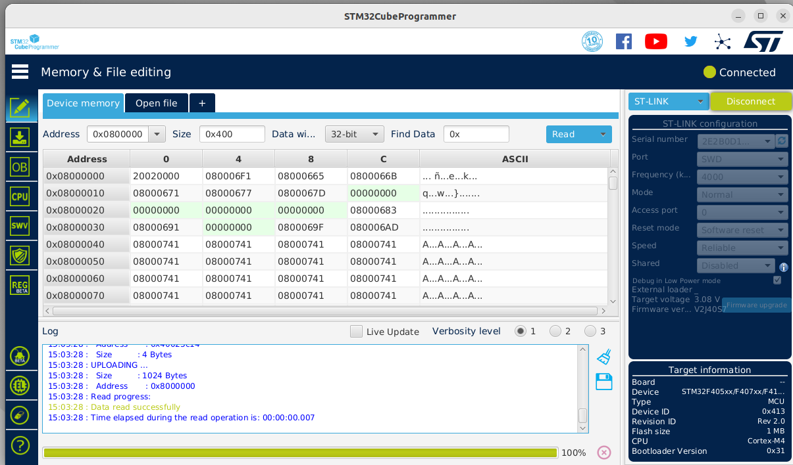
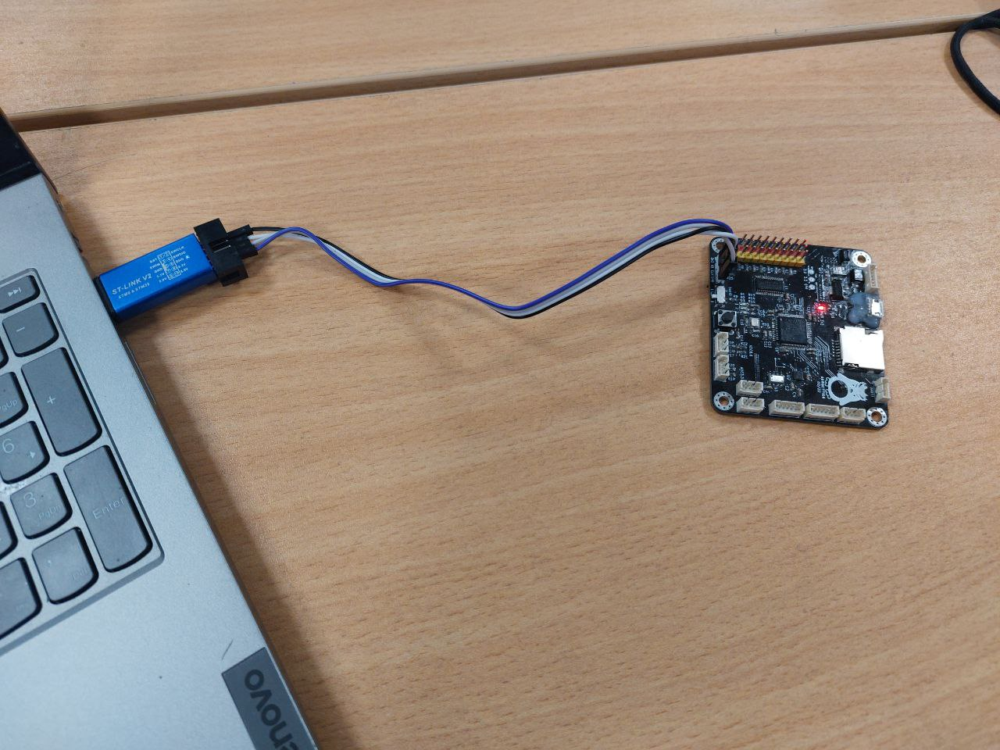

# 23-29 января
## 23.01.2023 понедельник
Сегодня начал разбираться с Юриной платой (работаю на Ubuntu)
* установил STM32CubeProgrammer
* Поставил драйверы для ST-LINK V2
* Обновил устаревшую прошивку на st-link v2
* подключил плату к STM32CubeProgrammer

  

научились заливать программы на плату  
научились крутить сервами  
(все это под виндой)  

## 24.01.2023 вторник
Настраиваю среду разработки у себя на linux (полезная статья https://habr.com/ru/post/343456/)