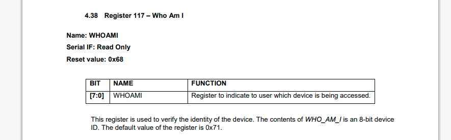
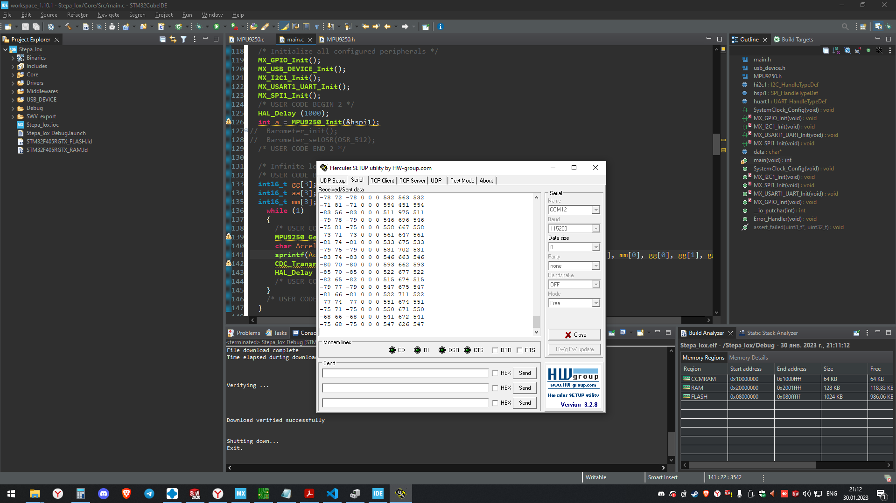

# 30 янв - 5 фев
## 30.01.2023 понедельник
Начал разбираться с MPU9250. 
* Использовал отредактированную библиотеку с этого репозитория  (код [тут](./test_lib/MPU_9250/MPU_9250_V1/))
* Не то число было в регистре WHOAMI #117 по умоланию  0x71  у нас 0x70

* удалось получить чистые данные


* часть кода main.c
```C++
        ...
        SPI_HandleTypeDef hspi1;
        int main()
        {
            ...
            int a = MPU9250_Init(&hspi1);
            ...

            int16_t gg[3];
            int16_t aa[3];
            int16_t mm[3];
            while (1)
            {
                MPU9250_GetData(&aa, &mm, &gg);
                char Accel[256];
                sprintf(Accel, "%d %d %d %d %d %d %d %d %d\n", aa[0], aa[1], aa[0], mm[0], mm[1], mm[0], gg[0], gg[1], gg[0]);
                CDC_Transmit_FS((uint8_t *)Accel, strlen(Accel));
                HAL_Delay (1000);
            }
        }
```
        
